<p align="center">
  
</p>

<h1 align="center">Vector — Autonomous AI Decision Intelligence & Infrastructure Assurance Platform</h1>

<p align="center">
  <strong>Deterministic Closed-Loop Site Reliability Engineering (SRE) with Multi-Criteria Decision Analysis (MCDA), Digital Twin Counterfactual Simulation, and Zero-Data-Loss SLA for Cloud-Native Infrastructure</strong>
</p>

<p align="center">
  <a href="https://github.com/vishnu7443/VectorAI_AISummit"></a>
  <a href="https://www.python.org/"></a>
  <a href="https://fastapi.tiangolo.com/"></a>
  <a href="https://react.dev/"></a>
  <a href="https://kubernetes.io/"></a>
  <a href="https://telegram.org/"></a>
  <a href="#license"></a>
</p>

---

## 📌 Executive Summary & Abstract

As modern microservices migrate toward distributed Kubernetes fabrics, operational complexity outpaces human cognitive bandwidth. While conventional **AIOps** and observability suites excel at post-facto anomaly detection and unconstrained LLM heuristic recommendations, they exhibit a fundamental systems flaw: **open-loop actuation without deterministic assurance**. Executing automated remediation actions (such as pod restarts, replica autoscaling, or resource eviction) in production without pre-flight risk bounds frequently induces **cascading thundering-herd failures, split-brain states, and fatal data degradation**.

**Vector** resolves this paradigm failure by introducing an intermediary **Deterministic Decision Intelligence & Assurance Layer** between predictive signal extraction and infrastructure actuation. Rather than asking *"What can the AI execute?"*, Vector enforces:

$$\text{"Under what formal safety, policy, and counterfactual constraints is this action provably safe to execute?"}$$

Vector integrates **Ordinary Least Squares (OLS) time-series forecasting**, **5-Dimensional Multi-Criteria Decision Analysis (MCDA)**, **Proportional State-Space Digital Twin Simulation**, and **Bi-Directional Interactive Mobile Approval Loops (Telegram)** to guarantee **Zero Data Loss** and fail-safe autonomy.

---

## 🏛️ Core Design Philosophy: Closed-Loop Observable Autonomy

Vector operates as a strict deterministic control plane following the cognitive loop:

$$\mathbf{Think} \longrightarrow \mathbf{Decide} \longrightarrow \mathbf{Assure} \longrightarrow \mathbf{Act} \longrightarrow \mathbf{Observe} \longrightarrow \mathbf{Learn}$$

```mermaid
flowchart LR
    subgraph INGEST ["1. Telemetry Ingest"]
        A[vector_agent.py / K8s / Prometheus] --> B[Telemetry Buffer]
    end

    subgraph PREDICT ["2. Signal Extraction"]
        B --> C[3-Sample Moving Average]
        C --> D[OLS Drift Velocity Model]
        D --> E[Time-to-Exhaustion Alert]
    end

    subgraph DECIDE ["3. Candidate Synthesis"]
        E --> F[Heuristic Policy Matcher]
        F --> G[Ranked Action Candidates]
    end

    subgraph ASSURE ["4. Decision Assurance Gatekeeper"]
        G --> H[Digital Twin State Projection]
        G --> I[Risk & Policy Bounds Check]
        H & I --> J[MCDA Trust Score Engine]
    end

    subgraph ACT ["5. Deterministic Actuation"]
        J -->|Trust Score ≥ 85| K[Autonomous Execution via Adapter]
        J -->|Trust Score < 85| L[Telegram Interactive Approval]
        L -->|Operator Approved| K
    end

    subgraph OBSERVE ["6. Audit & Recovery"]
        K --> M[Rollback Snapshot Store]
        K --> N[Tamper-Evident Audit Timeline]
        N --> A
    end

    style ASSURE fill:#1e1e2f,stroke:#6366f1,stroke-width:2px,color:#fff
    style ACT fill:#162447,stroke:#00d2d3,stroke-width:2px,color:#fff
```



---

## 🧠 Algorithmic & Mathematical Specifications

### 1. Ordinary Least Squares (OLS) Velocity & Exhaustion Forecasting
* **Implementation**: [`backend/services/prediction_service.py`](file:///d:/VectorAI/backend/services/prediction_service.py)
* **Objective**: Fit a closed-form first-order linear trend over trailing telemetry windows ($N=10$) to predict metric trajectory $300\text{s}$ into the future:

$$m = \frac{n \sum_{i=1}^n (x_i y_i) - \left( \sum_{i=1}^n x_i \right)\left( \sum_{i=1}^n y_i \right)}{n \sum_{i=1}^n x_i^2 - \left( \sum_{i=1}^n x_i \right)^2}, \quad c = \bar{y} - m\bar{x}$$

$$\hat{y}_{t + \Delta t} = m \cdot (x_t + \Delta t) + c$$

* **Time-to-Exhaustion ($T_{\text{exhaust}}$)**: Given an upper failure boundary $\tau_{\text{crit}}$ (e.g. $90\%$ CPU or Memory limit):

$$T_{\text{exhaust}} = \frac{\tau_{\text{crit}} - y_{\text{current}}}{m} \quad \text{for } m > 0$$

### 2. Multi-Criteria Decision Analysis (MCDA) Vector Scoring
* **Implementation**: [`backend/services/assurance_service.py`](file:///d:/VectorAI/backend/services/assurance_service.py)
* **Objective**: Transform heterogeneous validation dimensions into a scalar **Trust Score** $\mathcal{T} \in [0, 100]$:

$$\mathcal{T}_{\text{score}} = \mathbf{w}^T \mathbf{\Phi}(a, \mathcal{S}_t) = \sum_{k=1}^5 w_k \cdot \phi_k(a, \mathcal{S}_t)$$

| Dimension Metric | Weight ($w_k$) | Normalized Domain ($\phi_k$) | Evaluation Criteria |
| :--- | :---: | :---: | :--- |
| **Decision Confidence ($\mathcal{C}$)** | $0.25$ | $[0, 100]$ | Telemetry sample variance & linear regression $R^2$ fit |
| **Operational Risk Inversion ($100 - \mathcal{R}$)** | $0.20$ | $[0, 100]$ | Criticality weighting of workload ($1.0$ for DB, $0.6$ for frontend) |
| **Governance Compliance ($\mathcal{P}$)** | $0.20$ | $\{0, 100\}$ | Hard violation of replica bounds, maintenance windows, or cost limits |
| **Rollback Feasibility ($\mathcal{F}$)** | $0.20$ | $[0, 100]$ | Statefulness penalty: stateless pods $= 95$, DB connection pools $= 80$ |
| **Digital Twin Delta ($\Delta_{\text{twin}}$)** | $0.15$ | $[0, 100]$ | Simulated metric delta after applying proportional redistribution |

* **Execution Boundary**:
$$\text{Decision Mode} = \begin{cases} \mathbf{AUTO\_EXECUTE} & \text{if } \mathcal{T}_{\text{score}} \ge 85 \land \mathcal{R} \le 40 \land \mathcal{P} = 100 \\ \mathbf{HUMAN\_APPROVAL} & \text{if } \mathcal{T}_{\text{score}} < 85 \lor \mathcal{R} > 40 \lor \mathcal{P} < 100 \end{cases}$$

### 3. Proportional State-Space Digital Twin Simulation
* **Implementation**: [`backend/services/assurance_service.py`](file:///d:/VectorAI/backend/services/assurance_service.py)
* **Objective**: Evaluate hypothetical post-action system states in an in-memory counterfactual sandbox prior to issuing commands to the cluster orchestrator:

$$\hat{U}_{\text{projected}} = U_{\text{current}} \times \left( \frac{R_{\text{current}}}{R_{\text{target}}} \right)$$

$$\hat{L}_{\text{projected}} = L_{\text{current}} \times \left( \frac{R_{\text{current}}}{R_{\text{target}}} \right)^{0.7}$$

### 4. Dual-Threshold Hysteresis & Signal Smoothing
* **Implementation**: [`backend/api/prediction_router.py`](file:///d:/VectorAI/backend/api/prediction_router.py), [`backend/api/dashboard_router.py`](file:///d:/VectorAI/backend/api/dashboard_router.py)
* **Objective**: Prevent controller rapid-fire toggling (thrashing) near operational thresholds using asymmetric reset boundaries:
  - Trigger Alert: $U(t) \ge \tau_{\text{upper}} = 75\%$
  - De-escalate State: $U(t) \le \tau_{\text{lower}} = 60\%$
  - Discrete Signal Filter: $y_{\text{smooth}}(t) = \frac{1}{3} \sum_{k=0}^2 y(t-k)$

---

## 🏢 Real-World Production Integration: Inventra ERP Case Study

Vector includes native telemetry and policy profiles for enterprise client deployments, specifically modeled for **Inventra ERP** (a mission-critical enterprise resource planning system with strict zero-downtime and zero-data-loss SLAs).

```
   ┌────────────────────────────────────────────────────────────┐
   │                 Inventra ERP Client Cluster                │
   │                                                            │
   │  ┌─────────────────────────┐    ┌───────────────────────┐  │
   │  │       erp-frontend      │    │        erp-core       │  │
   │  │   2 Pods | High Crit    │    │  2 Pods | Crit Level  │  │
   │  └───────────┬─────────────┘    └───────────┬───────────┘  │
   │              │                              │              │
   │              ▼                              ▼              │
   │  ┌─────────────────────────┐    ┌───────────────────────┐  │
   │  │      erp-inventory      │    │         erp-db        │  │
   │  │    1 Pod | High Crit    │    │ 1 Pod | State Locked  │  │
   │  └─────────────────────────┘    └───────────────────────┘  │
   └──────────────────────────────┬─────────────────────────────┘
                                  │ vector_agent.py (Streaming SDK)
                                  ▼
   ┌────────────────────────────────────────────────────────────┐
   │                   Vector AI Ops Controller                 │
   │   • OLS Predictive Threat Detection                        │
   │   • Zero Data Loss Guard (DB State Protection)             │
   │   • Telegram Inline Two-Factor Approval Gateway            │
   └────────────────────────────────────────────────────────────┘
```

* **Client SDK (`vector_agent.py`)**: Standalone, zero-dependency streaming telemetry daemon deployed alongside client workloads to stream CPU, RAM, network socket bandwidth, and latency to Vector's Ingest API.
* **Locked 2-Tier Mode**: Protects stateful workloads (`erp-db`) by forbidding uncoordinated autonomous restarts while permitting autonomous horizontal scaling of stateless layers (`erp-frontend`).

---

## 💻 Systems Architecture & Directory Layout

```
d:/VectorAI/
├── .gitignore                   # Enterprise gitignore (caches, venvs, artifacts)
├── README.md                    # Core architectural specification
├── vector_agent.py              # Inventra ERP streaming telemetry client SDK
├── test_all_features.py         # End-to-end verification and integration test suite
├── vector.db                    # High-throughput SQLite telemetry datastore
├── backend/                     # High-performance asynchronous FastAPI core
│   ├── database.py              # SQLAlchemy engine and session pool
│   ├── main.py                  # Entrypoint, route registration & lifecycle loops
│   ├── models.py                # Schema definitions (Decisions, Policies, Telemetry)
│   ├── api/                     # REST Controller endpoints
│   │   ├── dashboard_router.py  # Health score & streaming cluster metrics
│   │   ├── decision_router.py   # Decision assurance evaluation & approval
│   │   ├── execution_router.py  # Workload actuation & rollback coordinator
│   │   ├── ingest_router.py     # High-throughput telemetry ingestion API
│   │   ├── notification_router.py# Telegram webhook dispatchers
│   │   ├── policy_router.py     # Governance matrix management
│   │   ├── prediction_router.py # OLS forecasting query service
│   │   ├── project_router.py    # Multi-tenant workspace management
│   │   ├── simulator_router.py  # Synthetic chaos & load injection
│   │   └── timeline_router.py   # Chronological audit & decision trail
│   ├── services/                # Algorithmic engine layers
│   │   ├── assurance_service.py # MCDA scoring & digital twin state modeling
│   │   ├── candidate_generator.py # Heuristic remediation action synthesizer
│   │   ├── infra_adapters.py    # Abstract Kubernetes & Prometheus adapter bridge
│   │   ├── metrics_service.py   # Background telemetry synthesis loop
│   │   ├── notification_service.py # Telegram bot listener & webhook dispatcher
│   │   └── prediction_service.py# Closed-form OLS linear regression engine
│   └── tests/
│       └── test_vector.py       # Pytest unit testing suite (100% passing)
└── frontend/                    # Vite + React 19 Command & Control Cockpit
    ├── index.html               # Semantic HTML5 container
    ├── package.json             # NPM dependencies & build scripts
    ├── vite.config.js           # Vite development server & proxy configuration
    └── src/
        ├── App.jsx              # Navigation controller & global state
        ├── pages/
        │   ├── Dashboard.jsx    # Real-time Mission Control cockpit
        │   ├── DecisionCenter.jsx# Assurance engine inspection & human approval
        │   ├── DigitalTwin.jsx   # Counterfactual state simulation sandbox
        │   ├── PolicyCenter.jsx # Declarative operational constraint editor
        │   ├── Simulator.jsx    # Synthetic incident generator
        │   ├── Timeline.jsx     # Chronological audit log
        │   └── LoginPage.jsx    # Role-based workspace authentication
        └── components/          # Reusable glassmorphic UI components
```

---

## 🎛️ The Operator Cockpit

The Vector UI is crafted as a high-density, glassmorphic mission control cockpit designed for platform engineers:

| Surface | Purpose & Functionality |
| :--- | :--- |
| **Mission Control Dashboard** | Real-time cluster health score ($0 - 100$), real-time Recharts CPU/Memory/Network streams, active anomaly warnings, and microservice status cards. |
| **Decision Intelligence Center** | The core USP surface. Displays calculated MCDA trust scores, 5-dimension radar breakdown, before-and-after digital twin projections, and one-click manual approval triggers. |
| **Digital Twin Sandbox** | Visualizes counterfactual states: shows what will happen to latency, memory, and CPU *before* an action is committed to live hardware. |
| **Policy Center** | Declarative governance console allowing SREs to enforce maximum scaling limits, restricted deployment windows, and mandatory human review overrides. |
| **Incident Simulator** | Interactive chaos engineering panel. Allows operators to inject synthetic CPU spikes, memory leaks, or network throttles into any microservice to observe real-time autonomous remediation. |

---

## 🚀 Quickstart & Local Reproduction Guide

### Prerequisites
* **Python**: 3.12+ (or [`uv`](https://github.com/astral-sh/uv) package manager)
* **Node.js**: v20+ & `npm`

### 1. Backend Service Launch
```bash
# Clone the repository
git clone https://github.com/vishnu7443/VectorAI_AISummit.git
cd VectorAI_AISummit

# Initialize virtual environment with uv or python
uv venv .venv --python 3.12
source .venv/bin/activate       # On Linux / macOS
# or: .venv\Scripts\activate   # On Windows

# Install backend dependencies
uv pip install fastapi uvicorn sqlalchemy pytest requests scikit-learn scipy numpy

# Launch FastAPI ASGI server
uvicorn backend.main:app --host 0.0.0.0 --port 8000 --reload
```
* Interactive API Documentation (Swagger): [`http://localhost:8000/docs`](http://localhost:8000/docs)
* Health Check Endpoint: [`http://localhost:8000/api/health`](http://localhost:8000/api/health)

### 2. Frontend Cockpit Launch
```bash
# In a separate terminal window:
cd frontend
npm install
npm run dev
```
* Access the interactive cockpit at: [`http://localhost:5173`](http://localhost:5173)
* Pre-configured Workspace Accounts:
  - **Inventra ERP**: `sriram@inventra.com` / `inventra123`
  - **Standard Cluster**: `operator@vector.ai` / `vector123`

### 3. Verify System Correctness
Execute the comprehensive end-to-end verification suite:
```bash
# Run unit tests
python -m pytest backend/tests/

# Run complete system integration suite
python test_all_features.py
```

Expected verification output:
```text
===========================================================================
 >>> VECTOR AI SRE - FULL SYSTEM FEATURE INTEGRATION VERIFICATION
===========================================================================
[TEST 1] 2-Tier Architecture & System Health Check...
  [PASS] Locked 2-Tier Architecture (erp-frontend, erp-db) Verified.
[TEST 2] OLS Linear Regression & MCDA Trust Score Evaluation...
  [PASS] OLS Slope Prediction & MCDA Trust Score Evaluated Successfully.
[TEST 3] Dispatches Real-Time Telegram Push Alert to Phone (@Vectorrrai_bot)...
  [PASS] Push Notification Delivered to Engineer's Telegram (@Vectorrrai_bot).
[TEST 4] Sends Interactive Telegram Approval Buttons ([Approve] & [Reject])...
  [PASS] Interactive [Approve & Execute] & [Reject Action] Buttons Sent to Telegram!
===========================================================================
 ALL 4 CORE FEATURES VERIFIED AND PASSING 100%!
===========================================================================
```

---

## 📱 Mobile Out-of-Band Telegram Approvals

For low-confidence or high-risk decisions ($\mathcal{T}_{\text{score}} < 85$ or stateful DB actions), Vector automatically pushes actionable notifications to the site engineer's mobile device via Telegram bot `@Vectorrrai_bot`:

```
┌────────────────────────────────────────────────────────┐
│ ⚠️ Vector AI SRE Alert: Resource Exhaustion Imminent   │
│                                                        │
│ Workload: erp-frontend                                 │
│ Prediction: 98.4% CPU exhaustion in 180s               │
│ Candidate: SCALE_DEPLOYMENT (2 -> 4 Replicas)          │
│ Trust Score: 78.4 / 100 (Below Auto-Execution Bound)   │
│ Operational Risk: Elevated                             │
│                                                        │
│ [ ✅ Approve & Execute ]    [ ❌ Reject & Suppress ]   │
└────────────────────────────────────────────────────────┘
```
Clicking **Approve** issues an authenticated webhook callback to `/api/decision-assurance/callback` which triggers the Kubernetes adapter and records the authorizing operator in the audit log.

---

## 📊 Comprehensive Comparative Analysis

| Feature Dimension | Legacy APM (Datadog/Dynatrace) | Conventional AIOps (PagerDuty/Moogsoft) | Vector Autonomous Assurance |
| :--- | :---: | :---: | :---: |
| **Telemetry Ingestion** | Push / Pull Agent | Webhook Aggregation | Authenticated Multi-Tier Streaming |
| **Trend Analysis** | Static Thresholds | Heuristic Clustering | **OLS Velocity Slope Forecasting** |
| **Lead-Time Exhaustion** | ❌ (Post-incident) | Partial | **Continuous Closed-Form ($T_{\text{exhaust}}$)** |
| **Remediation Suggestion** | ❌ Runbooks only | LLM Prompt / Script | **Heuristic Candidate Generator** |
| **Pre-Flight Digital Twin** | ❌ None | ❌ None | **Proportional Counterfactual State Simulation** |
| **Multi-Criteria Scoring** | ❌ None | Basic Severity Matrix | **5-Dimensional MCDA Vector Algorithm** |
| **Governance Enforcement** | ❌ Manual | Hardcoded Rules | **Declarative Dynamic Policy Engine** |
| **Rollback Synthesis** | ❌ Manual | ❌ Manual | **Automated Pre-Execution State Snapshotting** |
| **Interactive Out-of-Band** | Push alerts only | SMS / Voice escalation | **Telegram Bi-Directional Cryptographic Buttons** |

---

## 👥 Research & Engineering Team

**Team Codex** — AI Summit 2026

* **Vishnu Vardan R G** — Full-Stack Cockpit Engine, Telegram Gatekeeper & Adapter Layer
* **Sriram S** — Systems Architecture, Mathematical Modeling & Ingest Pipeline
* **Sanjay G** — Machine Learning Forecasting & Assurance Algorithms


---

## 📑 Citation & Academic Reference

If you utilize Vector's algorithms or architecture in your academic research or platform engineering benchmarks, please cite:

```bibtex
@software{vector_ai_2026,
  author    = {Vishnu Vardan R G , Sriram S. and , Yadhu Surya R , Sanjay G},
  title     = {Vector: Autonomous AI Decision Intelligence and Infrastructure Assurance Platform},
  year      = {2026},
  publisher = {GitHub},
  url       = {https://github.com/vishnu7443/VectorAI_AISummit}
}
```

---

## 📄 License

This project is licensed under the [MIT License](LICENSE) — developed with pride for the **AI Summit 2026**.
